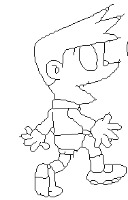
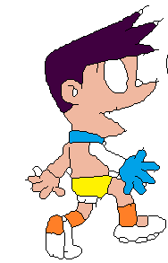
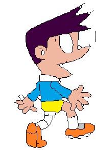

# Graph Matching Line-Art Colorization

## Features

- Graph matching approach for line-art colorization, refer from: https://ieeexplore.ieee.org/abstract/document/9412507
- Many-to-one constraint, greedy algorithm instead of hungarian in the original paper.
- We use IDSC instead of deep feature embedding.

## Entry point

```commandline
python main.py 
```

## Some results

We compare against the result of using node only & node + edge (spectral matching).

| reference image                                                | target image                                                 | result with node matching only                        | result with spectral matching only                        |
|----------------------------------------------------------------|--------------------------------------------------------------|-------------------------------------------------------|-----------------------------------------------------------|
|  |  |  |  |

